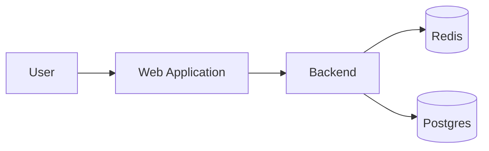
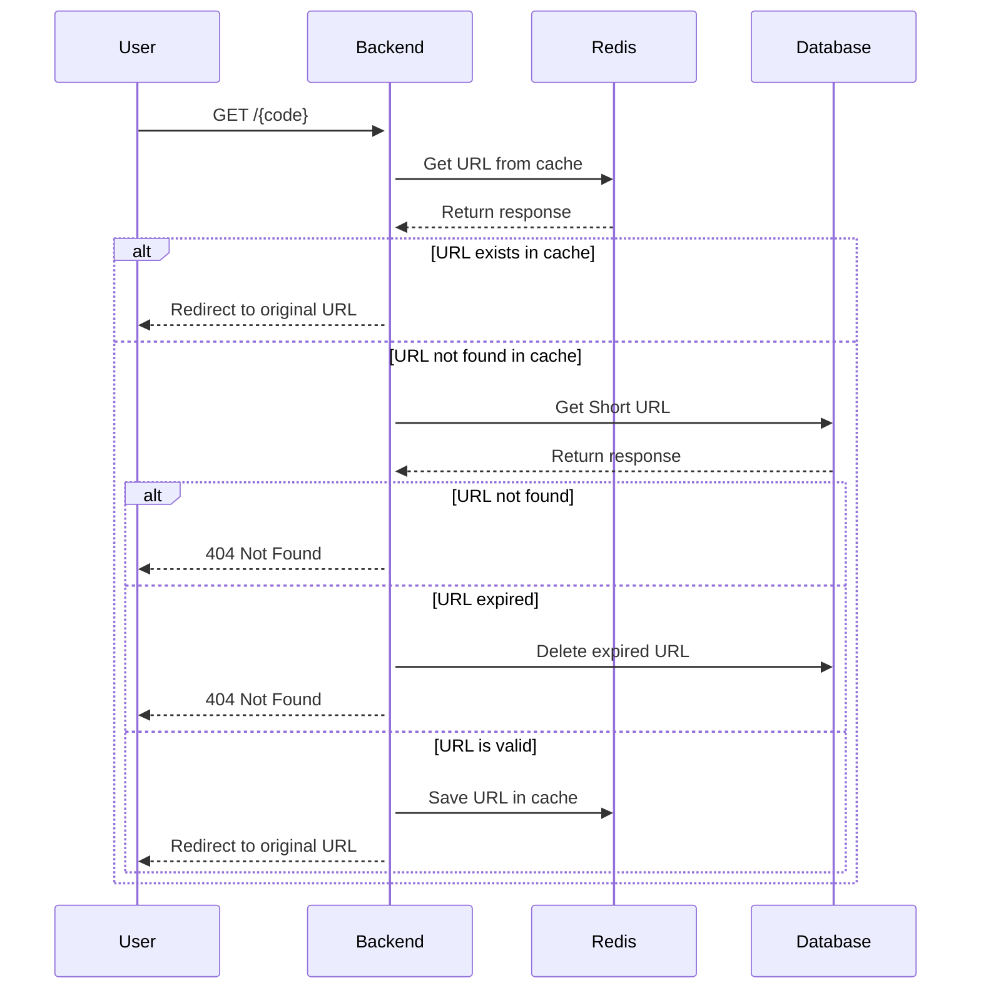
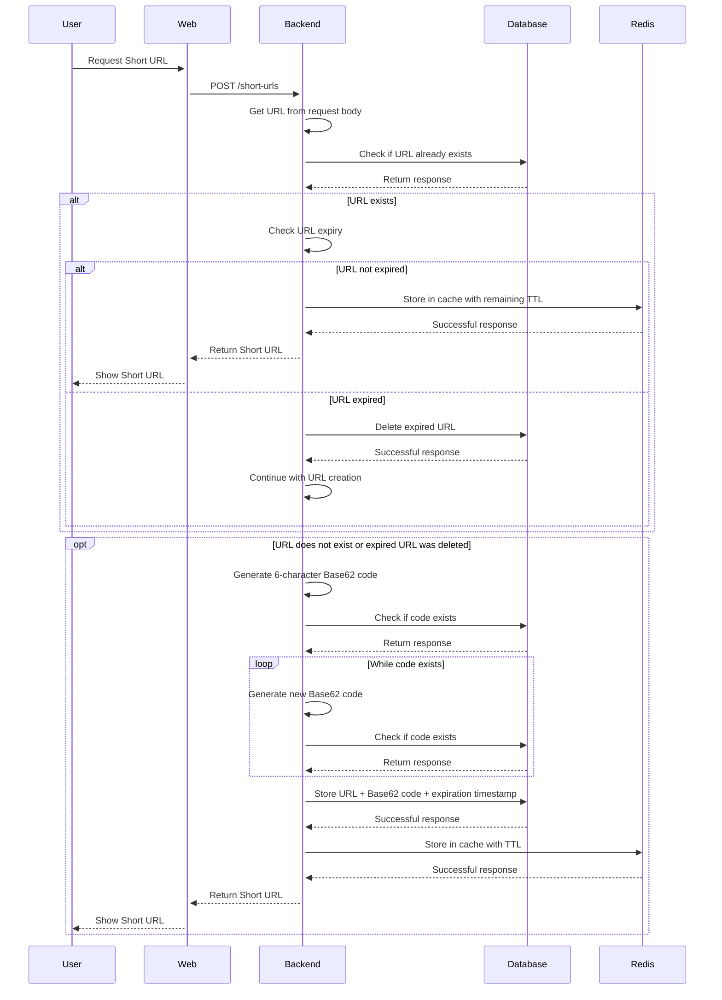
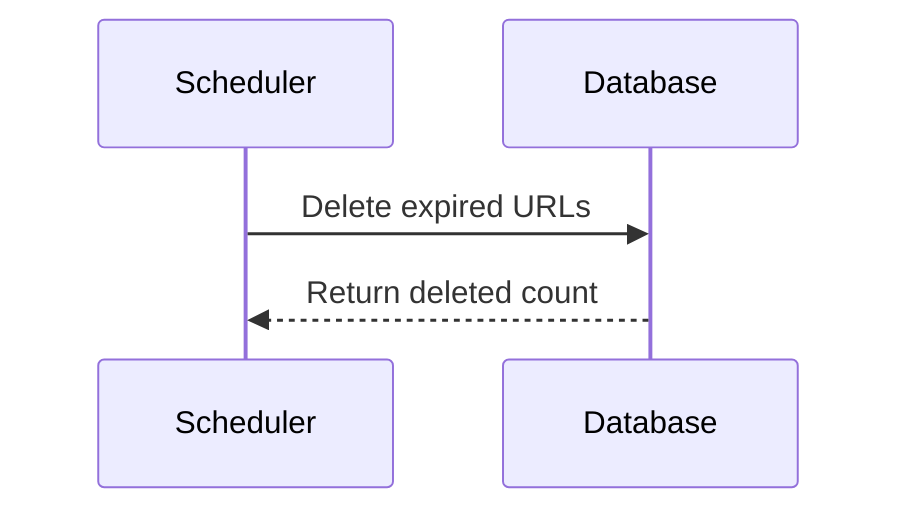

# Short URL

A simple URL shortening service built to explore backend architecture.

The service generates short URLs for long-form URLs and redirects users to the original destination when the generated URL is accessed.

## Quick Start

### Clone the repository

```bash
git clone https://github.com/iYasser95/short-url.git
cd shorturl
```

### Create environment file

```bash
cp example.env .env
```

### Start the application

```bash
docker compose up --build
```

### Open the application

```bash
http://localhost:5173
```
## Environment Variables

| Variable | Description |
|---|---|
| `SPRING_DATASOURCE_URL` | JDBC connection URL used by the backend to connect to Postgres. |
| `SPRING_DATASOURCE_USERNAME` | Postgres username used by Spring Boot. |
| `SPRING_DATASOURCE_PASSWORD` | Postgres password used by Spring Boot. |
| `POSTGRES_DB` | Database created by the Postgres container. |
| `POSTGRES_USER` | User created by the Postgres container. |
| `POSTGRES_PASSWORD` | Password for the Postgres user. |
| `SPRING_DATA_REDIS_HOST` | Redis hostname used by the backend. |
| `SPRING_DATA_REDIS_PORT` | Redis port used by the backend. |
| `REDIS_CACHE_LIMIT_BY_HOUR` | Controls the Redis cache-related hourly limit configured by the service. |
| `SHORTURL_BASE_URL` | Base URL used when generating the final short URL. |
| `SHORTURL_EXPIRATION_DAYS` | Number of days before a generated short URL expires. |
| `SHORTURL_CLEANUP_CRON` | Cron expression controlling how often expired URLs are removed from Postgres. |
| `APP_CORS_ALLOWED_ORIGIN` | Origin allowed to access the backend API through CORS. |
| `VITE_API_BASE_URL` | Backend API URL used by the React web application. |

## Features

- Generate 6-character Base62 short URLs.
- Redirect short URLs to their original destination.
- Prevent duplicate short URLs.
- Postgres persistence.
- Redis caching for faster redirections.
- Lazy deletion for expired URLs when accessed.
- Scheduled cleanup for expired URLs.

## Tech Stack

### Backend

- Spring Boot
- Postgres
- Redis
- Maven

### Web

- React
- TypeScript

### Infrastructure

- Docker
- Docker Compose

## Architecture

### Flowchart



#### Sequence - Resolve Short URL



#### Sequence - Create Short URL



#### Sequence - Scheduler



## Architecture Journey

If you want to follow the architecture evolution of this project, including the design decisions and changes made across each version, you can view the full project journey on my website:

[Short URL](https://yasserjaffer.com/projects/short-url)

## License

This project is licensed under the MIT License.
